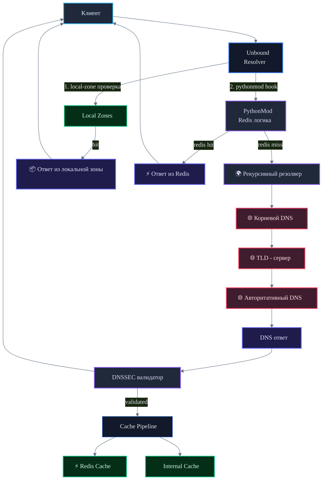

# DNS Cache Project

<p>
  <a href="https://redis.io/">
    
  </a>
  <a href="https://www.docker.com/">
    
  </a>
  <a href="https://nlnetlabs.nl/projects/unbound/about/">
    
  </a>
  <a href="https://www.python.org/">
    
  </a>
</p>


## Документы

| | |
|---|---|
| [Презентация](report/main.pptx) | Итоговая презентация проекта |
| [Отчёт](report/main.docx) | Финальный отчёт |
| [Черновик](report/README.md) | Файл с поэтапным решением, но в черновом варианте|

**Компоненты:**

| Компонент | Роль |
|---|---|
| **Unbound** | DNS-резолвер с поддержкой Python-модулей и локальных зон |
| **Redis** | Внешний кэш — хранит DNS-ответы дольше TTL |
| **Pythonmod** | Интеграция Unbound ↔ Redis, генерация зон |

## Структура репозитория

```
dns-cache-project/
├── unbound/
│   ├── unbound.conf          # основная конфигурация резолвера
│   ├── redis_pythonmod.py    # Python-модуль: интеграция с Redis
│   ├── local-zones.conf      # локальные зоны (переопределение DNSSEC)
│   ├── root.hints            # адреса корневых DNS-серверов
│   └── Dockerfile            # образ Unbound
├── redis/
│   └── redis.conf            # конфигурация Redis
├── scripts/
│   ├── fill_cache.py         # заполнение Redis DNS-записями
│   └── collect_zone.py       # сбор данных для локальных зон
├── report/
│   ├── README.md             # черновик отчёта
│   ├── main.docx             # финальный отчёт
│   ├── main.pptx             # презентация
│   └── assets/               # скриншоты и иллюстрации
└── docker-compose.yml        # инструкция запуска всего стека
```

## Схема рхитектуры DNS-резолвера с внешним кэшированием


