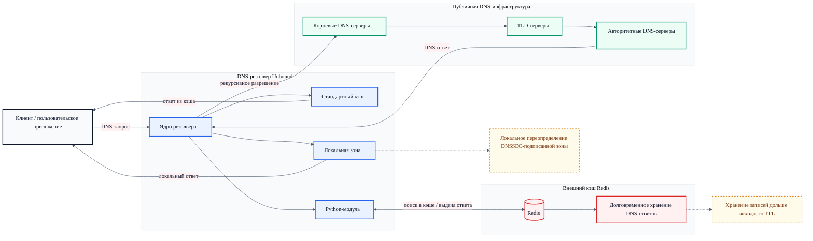

# DNS Cache Project

<p>
  <a href="https://redis.io/">
    
  </a>
  <a href="https://www.docker.com/">
    
  </a>
  <a href="https://nlnetlabs.nl/projects/unbound/about/">
    
  </a>
  <a href="https://www.python.org/">
    
  </a>
</p>

Проект посвящён исследованию DNS-кэширования и разработке собственного DNS-стенда на базе **Unbound**, **Redis** и **Docker**.

В рамках работы реализуется:
- проверка стандартного кэширования DNS-ответов;
- подключение внешнего кэша для хранения записей дольше исходного TTL;
- ответы резолвера из внешней базы данных;
- локальное переопределение DNSSEC-подписанной зоны на уровне собственного резолвера.

---

## О проекте

Этот репозиторий создан в рамках проектного кейса по теме:

**«Кэширование DNS (Применение внешних баз данных для кэширования DNS записей на неограниченный срок)»**

Цель проекта — показать, как собственный DNS-резолвер может:
- кэшировать DNS-ответы стандартными средствами;
- использовать внешний кэш Redis;
- хранить записи дольше исходного DNS TTL;
- отвечать из своей локальной базы данных;
- локально переопределять DNSSEC-подписанную зону.

---

## Для кого этот репозиторий

Репозиторий предназначен для:
- жюри и экспертов, проверяющих проект;
- участников команды;
- тех, кто хочет воспроизвести проект локально;
- всех, кто интересуется практикой DNS, Unbound и внешним кэшированием.

---

## Что находится в репозитории

Основные материалы проекта:

- **конфигурация Unbound**;
- **конфигурация Redis**;
- **Python-скрипты для генерации и подготовки данных**;
- **локальные зоны для подмены ответов**;
- **отчёт, скриншоты и демонстрационные материалы**.

---

## Где находится отчёт

Основной отчёт и сопутствующие материалы расположены в папке:

```text
report/
```

Там расположен черновик отчета - `README.md` и финальные версии оформленной работы и презентации - файлы `main`

## Архитектура
Проект построен вокруг трёх основных компонентов:

- **Unbound** — DNS-резолвер;
- **Redis** — внешний кэш DNS-ответов;
- **Pythonmod** — вспомогательная логика для интеграции, подготовки данных и генерации локальных зон.


