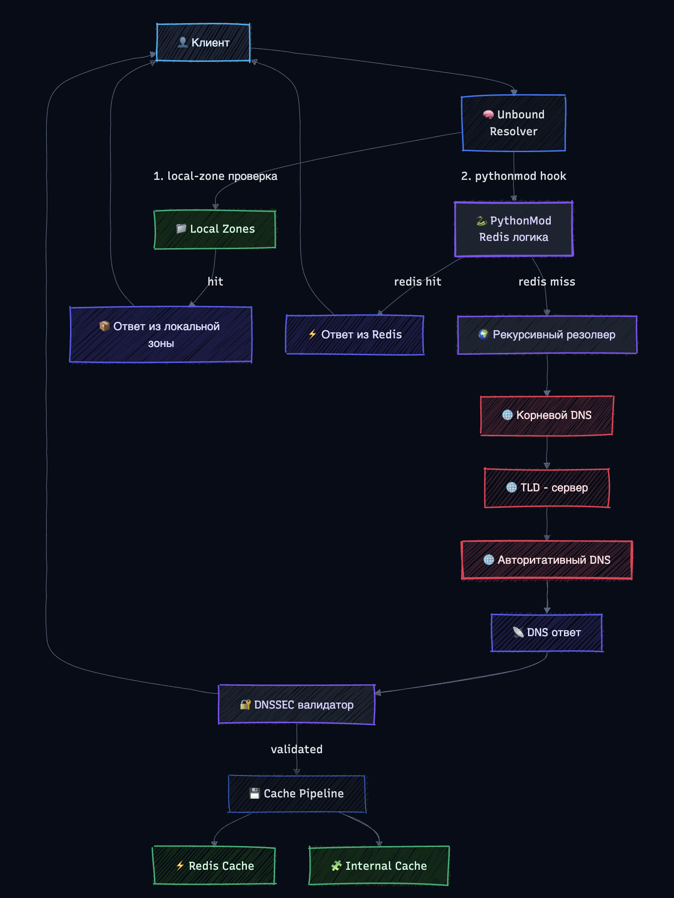

# DNS Cache Project

<p>
  <a href="https://redis.io/">
    
  </a>
  <a href="https://www.docker.com/">
    
  </a>
  <a href="https://nlnetlabs.nl/projects/unbound/about/">
    
  </a>
  <a href="https://www.python.org/">
    
  </a>
</p>

Этот репозиторий содержит реализацию решения кейса "Кэширование DNS (Применение внешних баз данных для кэширования DNS записей на неограниченный срок)" в рамках направления «Системный анализ и суперкомпьютерное моделирование» конкурса «Твой проект» 2025/2026.

Проект демонстрирует возможности по:
- Продлению времени жизни (TTL) DNS-записей сверх установленного значения
- Использованию внешней базы данных (Redis) для кэширования DNS-ответов
- Обходу ограничений DNSSEC через локальную подмену DNS-зон


## Документы

| | |
|---|---|
| [Презентация](report/main.pptx) | Итоговая презентация проекта |
| [Отчёт](report/main.docx) | Финальный отчёт |
| [Черновик](report/README.md) | Файл с поэтапным решением, но в черновом варианте|

**Компоненты:**

| Компонент | Роль |
|---|---|
| **Unbound** | DNS-резолвер с поддержкой Python-модулей и локальных зон |
| **Redis** | Внешний кэш — хранит DNS-ответы дольше TTL |
| **Pythonmod** | Интеграция Unbound ↔ Redis, генерация зон |

## Структура репозитория

```
dns-cache-project/
├── unbound/
│   ├── unbound.conf          # основная конфигурация резолвера
│   ├── redis_pythonmod.py    # Python-модуль: интеграция с Redis
│   ├── local-zones.conf      # локальные зоны (переопределение DNSSEC)
│   ├── root.hints            # адреса корневых DNS-серверов
│   └── Dockerfile            # образ Unbound
├── redis/
│   └── redis.conf            # конфигурация Redis
├── scripts/
│   ├── fill_cache.py         # заполнение Redis DNS-записями
│   └── collect_zone.py       # сбор данных для локальных зон
├── report/
│   ├── README.md             # черновик отчёта
│   ├── main.docx             # финальный отчёт
│   ├── main.pptx             # презентация
│   └── assets/               # скриншоты и иллюстрации
└── docker-compose.yml        # инструкция запуска всего стека
```

## Схема рхитектуры DNS-резолвера с внешним кэшированием




Mermaid код для генерации схемы 
```txt
%%{init: {
  "theme": "base",
  "themeVariables": {
    "background": "#FFFFFF",
    "primaryColor": "#F9FAFB",
    "primaryTextColor": "#111827",
    "primaryBorderColor": "#2563EB",
    "lineColor": "#9CA3AF",
    "fontFamily": "Inter, Arial, sans-serif",
    "fontSize": "16px"
  }
}}%%

flowchart TD

    %% CLIENT
    CLIENT["👤 Клиент"]

    %% ENTRY
    UNBOUND["🧠 Unbound<br/>Resolver"]

    %% MODULES
    PYMOD["🐍 PythonMod<br/>Redis логика"]
    VALIDATOR["🔐 DNSSEC валидатор"]
    ITERATOR["🌍 Рекурсивный резолвер"]

    %% DATA SOURCES
    LOCAL["📁 Local Zones"]
    REDIS["⚡ Redis Cache"]

    ROOT["🌐 Корневой DNS"]
    TLD["🌐 TLD - сервер"]
    AUTH["🌐 Авторитативный DNS"]

    %% FLOW

    CLIENT --> UNBOUND

    %% LOCAL ZONE CHECK
    UNBOUND -->|1. local-zone проверка| LOCAL
    LOCAL -->|hit| RESPONSE_LOCAL["📦 Ответ из локальной зоны"]

    %% PYTHONMOD
    UNBOUND -->|2. pythonmod hook| PYMOD
    PYMOD -->|redis hit| RESPONSE_REDIS["⚡ Ответ из Redis"]
    PYMOD -->|redis miss| ITERATOR

    %% RECURSION
    ITERATOR --> ROOT
    ROOT --> TLD
    TLD --> AUTH
    AUTH --> RESPONSE_AUTH["📡 DNS ответ"]

    %% DNSSEC
    RESPONSE_AUTH --> VALIDATOR
    VALIDATOR -->|validated| CACHE_STORE

    %% STORE
    CACHE_STORE["💾 Cache Pipeline"] --> REDIS
    CACHE_STORE --> UNBOUND_CACHE["🧩 Internal Cache"]

    %% RETURN
    RESPONSE_LOCAL --> CLIENT
    RESPONSE_REDIS --> CLIENT
    VALIDATOR --> CLIENT

    %% STYLES

    classDef client fill:#EFF6FF,stroke:#3B82F6,stroke-width:2px,color:#1E3A8A;
    classDef core fill:#F1F5F9,stroke:#2563EB,stroke-width:2px,color:#0F172A;
    classDef module fill:#F5F3FF,stroke:#7C3AED,stroke-width:2px,color:#4C1D95;
    classDef data fill:#ECFDF5,stroke:#10B981,stroke-width:2px,color:#065F46;
    classDef ext fill:#FFF1F2,stroke:#F43F5E,stroke-width:2px,color:#7F1D1D;
    classDef result fill:#EEF2FF,stroke:#6366F1,stroke-width:2px,color:#1E1B4B;

    class CLIENT client;
    class UNBOUND core;

    class PYMOD,VALIDATOR,ITERATOR module;

    class LOCAL,REDIS,UNBOUND_CACHE data;

    class ROOT,TLD,AUTH ext;

    class RESPONSE_LOCAL,RESPONSE_REDIS,RESPONSE_AUTH result;
```
