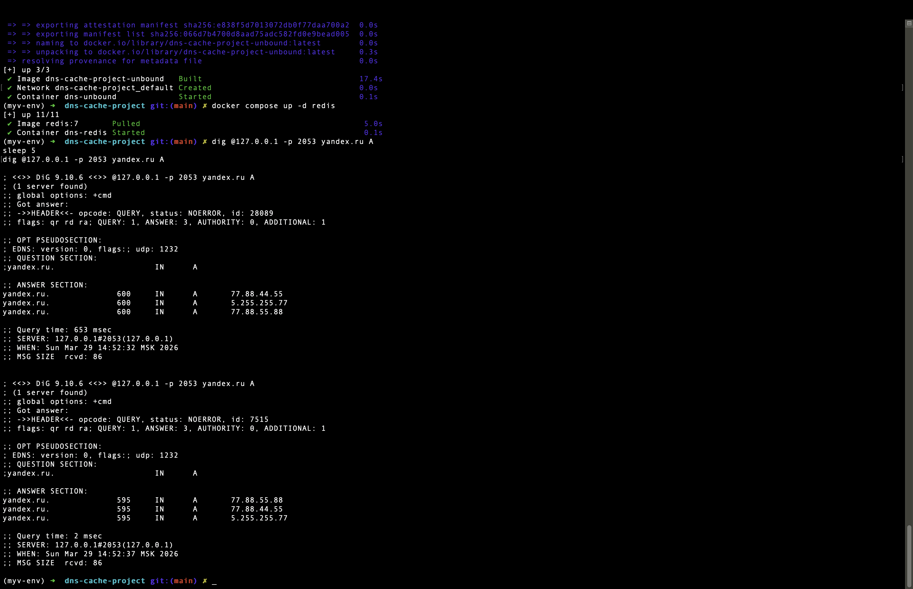
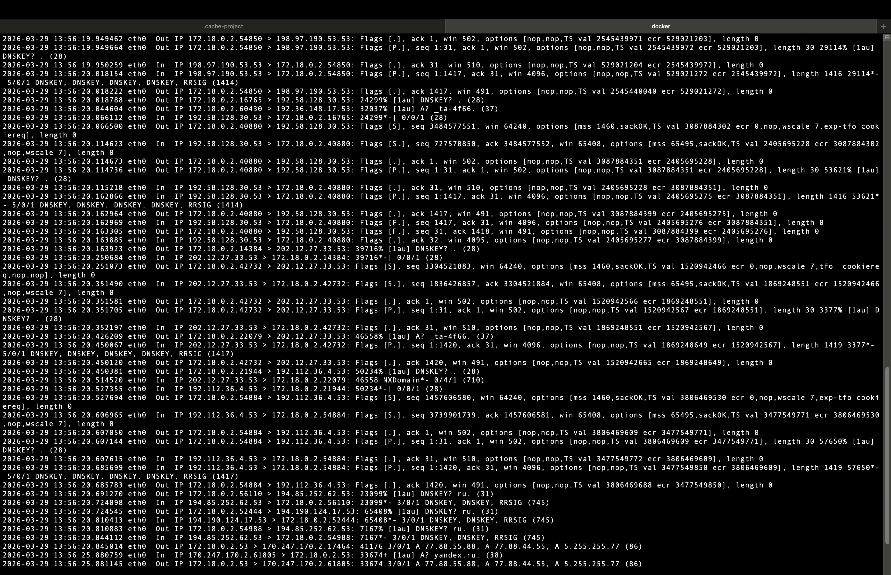
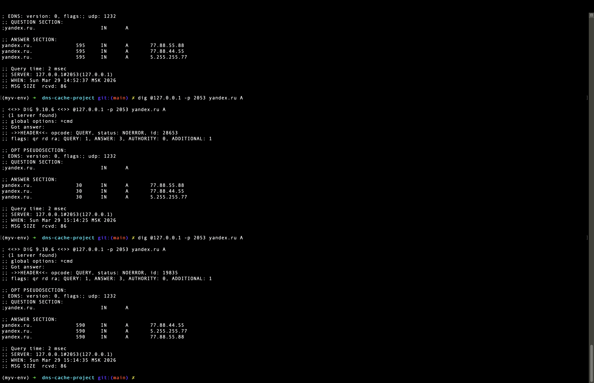
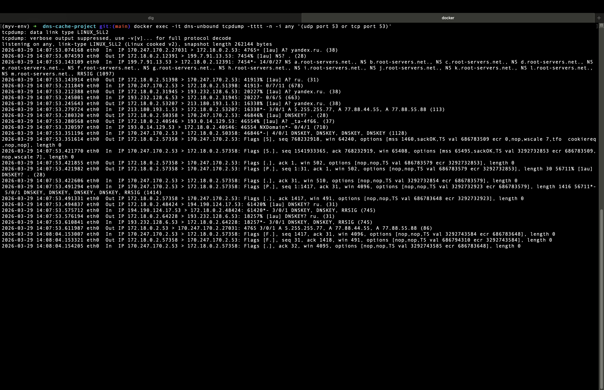
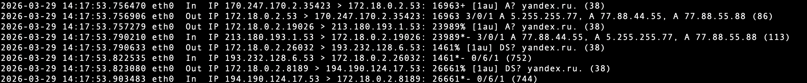
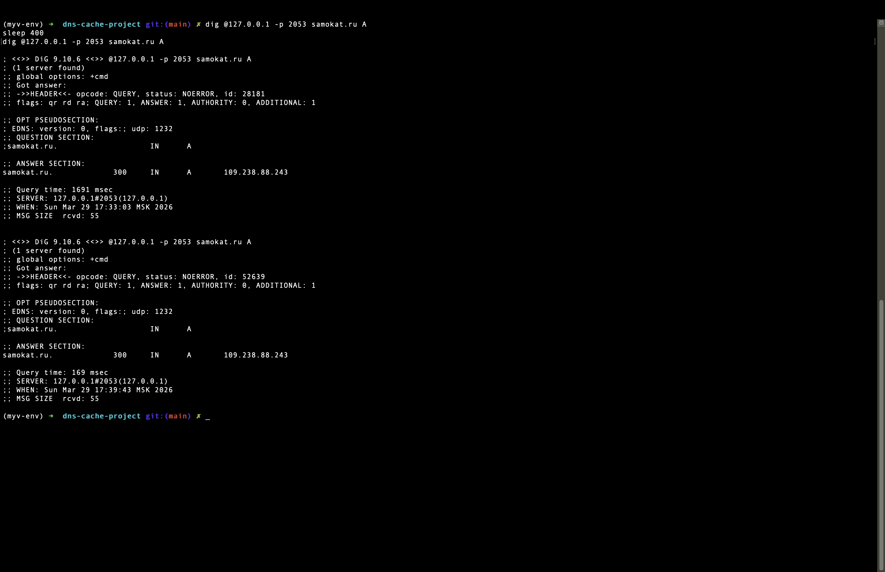
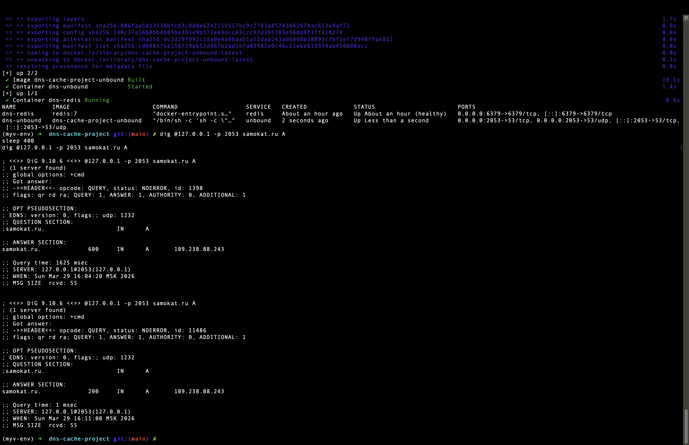
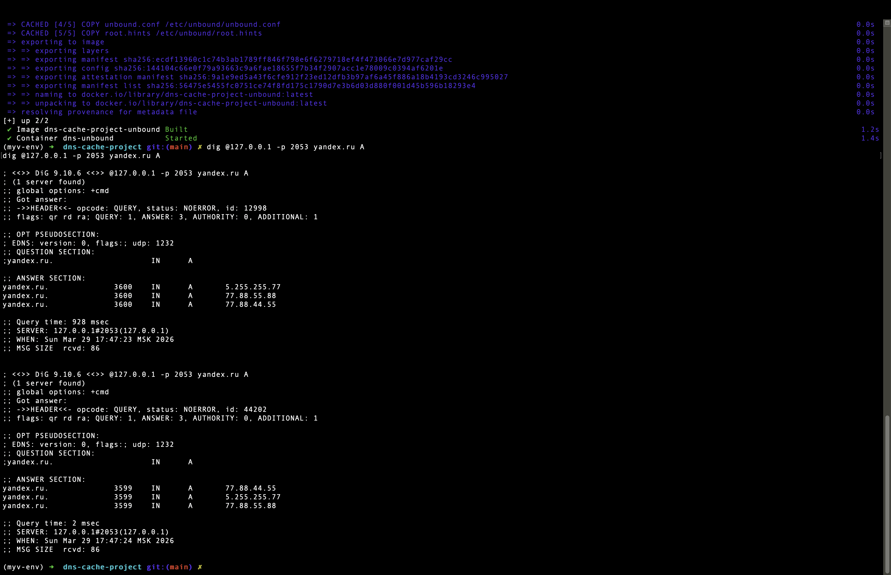
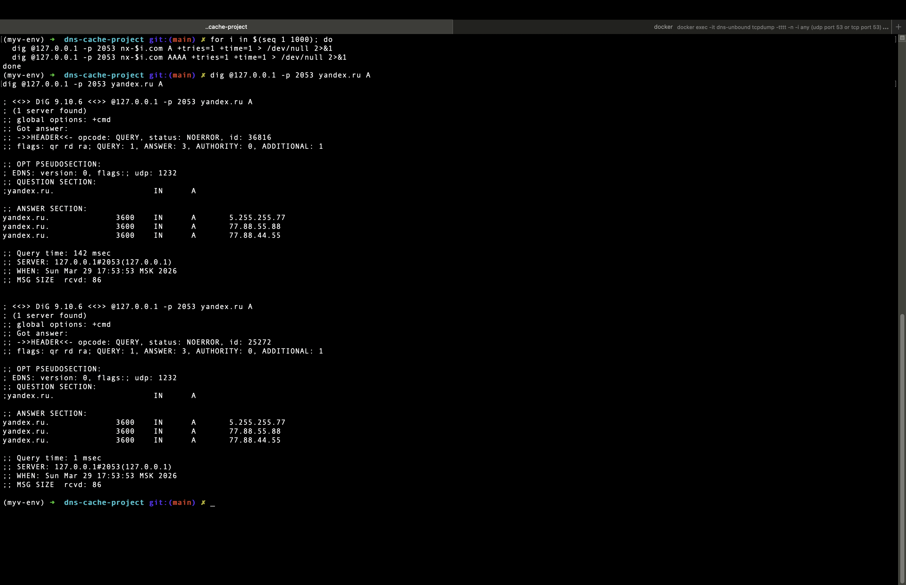
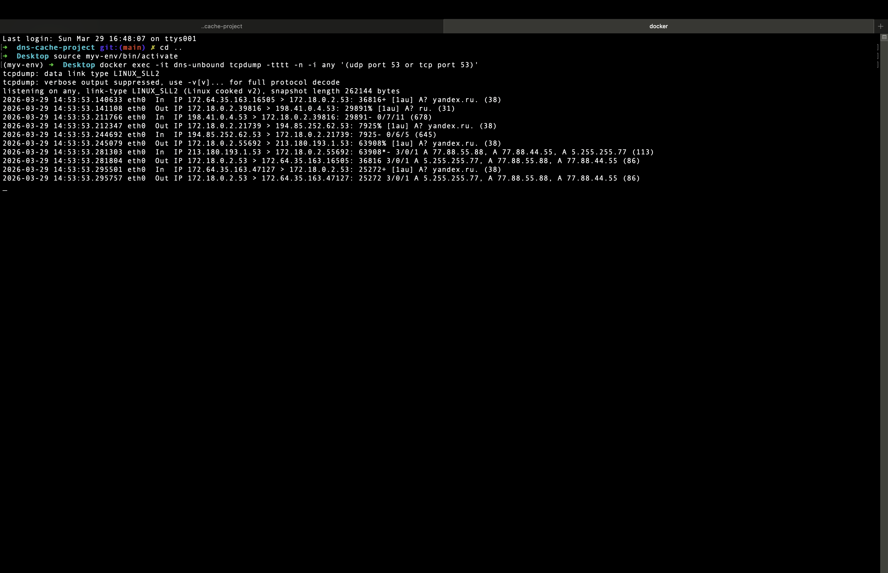

Здесь пройдемся по пунктам заданий, это черновик оформленного решения, чистое решение находится тут - [ВСТАВИТЬ]

Тема - Кэширование ответов на время отличное от времени TTL

## Интро
Для того, чтобы все описанное ниже работало необходимо подготовиться, включить докер и настроить окружение, опишу потом
```bash
docker compose up -d --build unbound
docker compose up -d redis
docker compose ps
```

Если необходимо перезапустить можно так
```bash
docker compose up -d --build unbound
```

## 1.1 Проверка кэширования стандартными средствами резолвера.
Определение того, откуда пришел ответ будем по 3 признакам.
- 1. Уменьшение времени ответа, если ответ пришел из кеша
- 2. Изменение TTL при повторном запросе, если во втором TTL ниже, то скорее всего он взялся из кеша
- 3. По tcpdump, для втором окне терминала запустим
```bash
docker exec -it dns-unbound tcpdump -tttt -n -i any '(udp port 53 or tcp port 53)'
```

- если в tcpdump видны исходящие DNS-запросы от контейнера Unbound во внешнюю сеть, значит это cache miss
- если виден только входящий запрос к Unbound, но нет внешних DNS-запросов, значит это cache hit
- если ответ клиенту быстрый, но после него появились внешние DNS-запросы, значит сработал prefetch

### 1.1А - Кэширование ответа Yandex.ru (адресная запись) проверка истечения времени кэширования
Для проверки того, что работает введем в терминал данные строки
```bash
dig @127.0.0.1 -p 2053 yandex.ru A
sleep 5
dig @127.0.0.1 -p 2053 yandex.ru A
```



На скриншоте видно, что есть изменения, а именно

```txt
Query time: 653 msec -> Query time: 2 msec

Изменение TTL
yandex.ru.		600	IN	A	77.88.44.55
yandex.ru.		600	IN	A	5.255.255.77
yandex.ru.		600	IN	A	77.88.55.88

yandex.ru.		595	IN	A	77.88.55.88
yandex.ru.		595	IN	A	77.88.44.55
yandex.ru.		595	IN	A	5.255.255.77
```

Видно, что TTl 600 -> 595, что согласуется с тем, что мы ждали 5 секунд, а также время ожидания упало, а теперь проверим tcpdump


В данной картинке много шума, но разберем ключевые,
Это было при первом запросе
```txt
2026-03-29 13:56:20.845014 eth0  Out IP 172.18.0.2.53 > 170.247.170.2.17464: 41176 3/0/1 A 77.88.55.88, A 77.88.44.55, A 5.255.255.77 (86)
```
А при втором запросе вывелось
```txt
2026-03-29 13:56:25.880759 eth0  In  IP 170.247.170.2.61805 > 172.18.0.2.53: 33674+ [1au] A? yandex.ru. (38)
2026-03-29 13:56:25.881145 eth0  Out IP 172.18.0.2.53 > 170.247.170.2.61805: 33674 3/0/1 A 77.88.55.88, A 77.88.44.55, A 5.255.255.77 (86)
```

То есть между этими двумя строками для второго запроса нет новых внешних запросов на yandex.ru. А значит Unbound получил вопрос от клиента, сразу ответил, наружу за yandex.ru не ходил.

### 1.1Б включение функции prefetch
Она уже включена, в unbound.conf стоит `prefetch: yes`

Prefetch в Unbound работает так:
> если запись уже есть в кэше, ее TTL почти истекает и приходит новый запрос, то
Unbound отдает ответ из кэша сразу и параллельно обновляет запись в фоне.

То есть по сути это функция обновления кеша, TTL которых близится к концу. Для проверки отправим на тот же yandex.ru запрос перед истечением TTL, в теории при последующем запросе через пару секунд TTL должно снова стать большим, а время ожидания низким (так как ответ подтягивается из кеша, а мы не просто подождали пока запись удалится), проверим это

```bash
dig @127.0.0.1 -p 2053 yandex.ru A
sleep 530
dig @127.0.0.1 -p 2053 yandex.ru A
```



В терминале мы видим то, что и ожидали
```txt
Query time: 2 msec -> Query time: 2 msec

Изменение TTL
yandex.ru.		30	IN	A	77.88.55.88
yandex.ru.		30	IN	A	77.88.44.55
yandex.ru.		30	IN	A	5.255.255.77

yandex.ru.		590	IN	A	77.88.44.55
yandex.ru.		590	IN	A	5.255.255.77
yandex.ru.		590	IN	A	77.88.55.88
```

Проверим также по tcpdump, изначально по первому запросу было так

А по второму так



### 1.1В Установка времени принудительного кэширования стандартными средствами, если допустимо, на выбранном резолвере, и проверка истечения времени кэширования
На самом Unbound это получится реализовать, так что продемонстрируем. Можно реализовать двумя способами:
- `cache-min-ttl` - установка минимального ttl в обход того, что получаем
- `cache-max-ttl` - установка максимального значения, так как мы хотим принудительно кешировать, то нам скорее надо минимум надо установить, а не максимум
- `serve-expired` - дополнительная выдача старых значений, после истечения TTL (можно использовать, но покажем на `cache-min-ttl`)

Проверим, что в unbound.conf стоит `cache-min-ttl` (Это значение могло поменяться в какой-то версии)
Проверим на сайте `samokat.ru` у них стоит TTL = 300, установим `cache-min-ttl = 0` и подождем 400 секунд, при повторном запросе cache уже очистится и мы получим новый запрос, а при `cache-min-ttl = 600` новый запрос отправляться не будет, а будет подтягиваться из кеша, проверим это на одном и том же запросе, но с разными параметрами (после изменения параметров нужно перезапустить докер и пересобрать) (Для визуализации надо выставить `serve-expired: no`)

```bash
docker compose up -d --build unbound
docker compose up -d --build unbound
docker compose up -d redis
docker compose ps
```

Запустим запрос ниже при разных параметрах

```bash
dig @127.0.0.1 -p 2053 samokat.ru A
sleep 400
dig @127.0.0.1 -p 2053 samokat.ru A
```

При `cache-min-ttl = 0`


При `cache-min-ttl = 600`


На скриншотах видно по времени ожидания и по TTL, что наш параметр правильно работает и при первом случае отправляется новый запрос, а при втором ответ подтягивается из кеша


### 1.1Г Превышение возможностей кэширования стандартной сборки резолвера и обнаружение факта принудительной очистки кэша
По сути нужно показать, что даже если мы заставили резолвер держать запись дольше TTL, встроенный кэш все равно ограничен по объему, и запись может быть вытеснена раньше. В конфигурации Unbound это выставляется вот этими параметрами
```bash
rrset-cache-size: 128m
msg-cache-size: 64m
```

Они означают:
- `rrset-cache-size` — объем памяти, выделяемый под хранение наборов ресурсных записей DNS (RRset), например A, AAAA, NS, TXT и других;
- `msg-cache-size` — объем памяти, выделяемый под хранение уже собранных DNS-ответов (message cache), которые могут быть быстро возвращены клиенту.

План эксперимента:
- 1. сильно уменьшаем размеры встроенного кэша;
- 2. ставим большой cache-min-ttl, чтобы запись жила долго;
- 3. запоминаем одну запись (yandex.ru);
- 4. забиваем кэш множеством уникальных запросов;
- 5. снова спрашиваем yandex.ru;
- 6. показываем, что Unbound снова идет наружу — значит запись была вытеснена.

Для чистоты эксперимента выставим
```bash
prefetch: no
serve-expired: no
```

В итоге временно выставим вот такие параметры в `unbound.conf`
```txt
server:
    interface: 0.0.0.0
    port: 53
    access-control: 0.0.0.0/0 allow

    verbosity: 1
    logfile: ""

    directory: "/etc/unbound"
    root-hints: "/etc/unbound/root.hints"
    auto-trust-anchor-file: "/var/lib/unbound/root.key"

    module-config: "validator iterator"

    prefetch: no
    serve-expired: no

    cache-min-ttl: 3600
    cache-max-ttl: 86400

    rrset-cache-size: 256k
    msg-cache-size: 128k

    hide-identity: yes
    hide-version: yes

    do-ip4: yes
    do-ip6: yes
    do-udp: yes
    do-tcp: yes
```

Пересоберем образ
```bash
docker compose up -d --build unbound
```

И включим tcpdump во втором терминале
```bash
docker exec -it dns-unbound tcpdump -tttt -n -i any '(udp port 53 or tcp port 53)'
```

Теперь введем пробный запрос, видим стандартную картину того, что первый отправился, а второй подтянулся из кеша
```bash
dig @127.0.0.1 -p 2053 yandex.ru A
dig @127.0.0.1 -p 2053 yandex.ru A
```



Теперь постараемся переполнить кеш и затем снова задать этот запрос
```bash
for i in $(seq 1 1000); do
  dig @127.0.0.1 -p 2053 nx-$i.com A +tries=1 +time=1 > /dev/null 2>&1
  dig @127.0.0.1 -p 2053 nx-$i.com AAAA +tries=1 +time=1 > /dev/null 2>&1
done

dig @127.0.0.1 -p 2053 yandex.ru A
dig @127.0.0.1 -p 2053 yandex.ru A
```



И посмотрим что выдал tcpdump



Видно, что кеш еще не протух, но уже первый запрос задавался снова, а второй подтянулся из кеша, а значит мы подтвердили гипотезу. Для точной диагностики можем посмотреть в ответ tcpdump - он выдал ту же картину, сначала он идет наружу

```txt
2026-03-29 14:53:53.141108 ... Out ... A? ru.
2026-03-29 14:53:53.212347 ... Out ... A? yandex.ru.
2026-03-29 14:53:53.245079 ... Out ... A? yandex.ru.
```
Потом получает внешний ответ:

```txt
2026-03-29 14:53:53.281303 ... In  ... A 77.88...
```
И только после этого отвечает клиенту

```txt
2026-03-29 14:53:53.281804 ... Out ... A 5.255.255.77, ...
```

Это значит, что кеш удалось переполнить и значение удалилось до истечения времени хранения.
